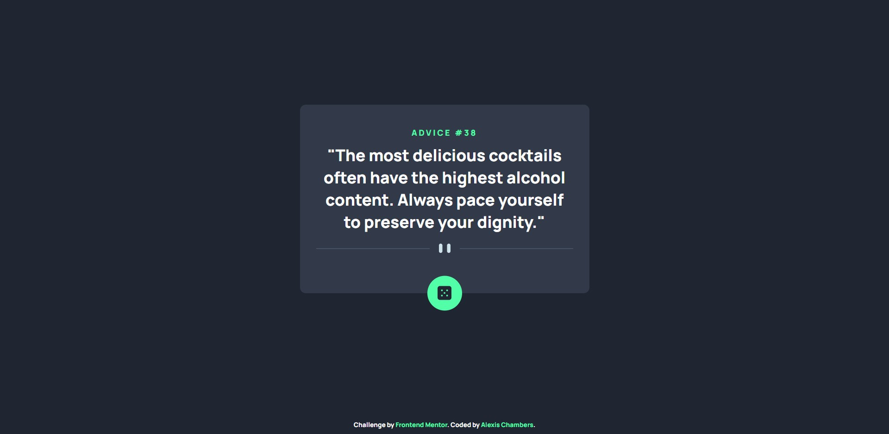
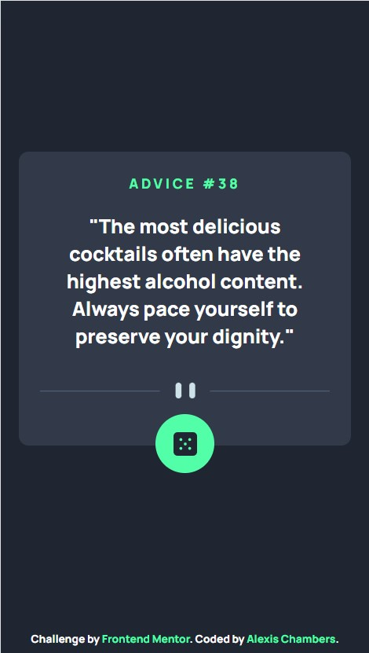

# Frontend Mentor - Advice generator app solution

This is a solution to the [Advice generator app challenge on Frontend Mentor](https://www.frontendmentor.io/challenges/advice-generator-app-QdUG-13db). Frontend Mentor challenges help you improve your coding skills by building realistic projects.

## Table of contents

- [Overview](#overview)
  - [The challenge](#the-challenge)
  - [Screenshot](#screenshot)
  - [Links](#links)
- [My process](#my-process)
  - [Built with](#built-with)
  - [What I learned](#what-i-learned)
  - [Useful resources](#useful-resources)
- [Author](#author)


## Overview

### The challenge

Users should be able to:

- View a display appropriate to their screen size
- Click the glowing dice button to reset the page, getting a new advice slip each time they reset

### Screenshot





### Links

- Solution URL: [Add solution URL here](https://your-solution-url.com)
- Live Site URL: [Add live site URL here](https://your-live-site-url.com)

## My process

### Built with

- Semantic HTML5 markup
- CSS custom properties
- Flexbox
- Mobile-first workflow
- API

### What I learned

- how to use an API
- how to use a window reload function to generate a new slip of advice

```js
const proudOfThisFunc = () => {
  var data = JSON.parse(this.response);
  var slip = data.slip;
  var id = slip.id;
  var advice = slip.advice;


    if (request.status >= 200 && request.status < 400) {
        adviceID.textContent = `ADVICE #${id}`;
        adviceText.textContent = `"${advice}"`;
    } else {
        console.log('error')
    }
}
```


### Useful resources

- [Tania Rascia's How to Connect to an API with JavaScript](https://www.taniarascia.com/how-to-connect-to-an-api-with-javascript/) - This article helped me learn how to use an API by guiding me through the process of building a Studio Ghibli themed website using an API to retrieve movie titles and descriptions.


## Author

- Frontend Mentor - [@kowai-onigiri](https://www.frontendmentor.io/profile/kowai-onigiri)

